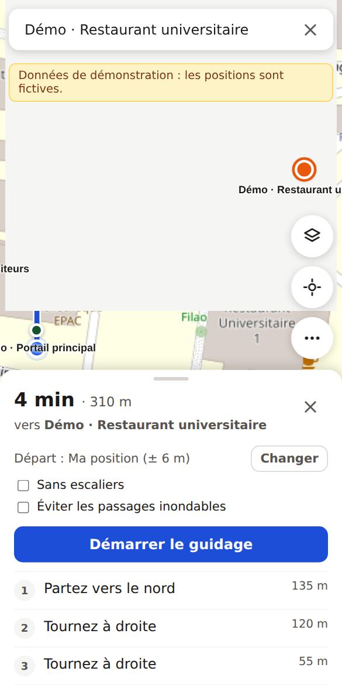
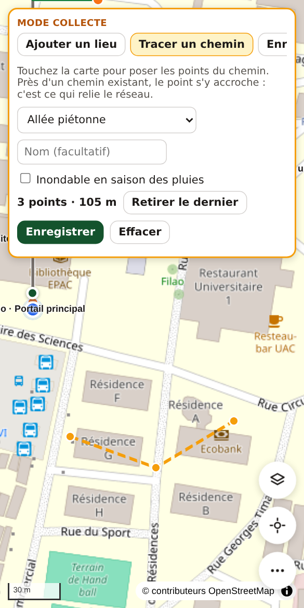

# Carte UAC

[](https://github.com/Magloire04/uac_map/actions/workflows/ci.yml)
[](LICENSE)

Carte et guidage piéton pour le campus de l'Université d'Abomey-Calavi (UAC). On tape « scolarité », « BU » ou « amphi 1000 », et l'appli trace le chemin à pied jusqu'à la bonne porte, avec des consignes en français et un guidage GPS. Elle fonctionne dans le navigateur du téléphone, sans installation, et continue sans réseau une fois la carte chargée.

> **Statut : en ligne** sur [uacmap.bytechnum.com](https://uacmap.bytechnum.com) (version 0.3.1). Le moteur d'itinéraire, l'API, le mode collecte et la contribution ouverte fonctionnent. La carte se remplit au fil des relevés de l'équipe et des propositions relues. En local, le premier lancement charge un réseau **fictif** de démonstration.

| Itinéraire                                                                 | Mode collecte : tracé d'un chemin                               |
| -------------------------------------------------------------------------- | --------------------------------------------------------------- |
|  |  |

## Fonctionnalités

**Pour les visiteurs et les étudiants**

- Recherche qui accepte les sigles, les surnoms, l'absence d'accents et une faute de frappe.
- Itinéraire à pied jusqu'à l'entrée la plus proche du bâtiment, avec options sans escaliers et sans passages inondables.
- Consignes ancrées sur des repères : « Tournez à droite, au niveau de la BU ».
- Guidage GPS avec distance restante, précision affichée et recalcul automatique en cas d'écart.
- Point de départ au choix : GPS, QR code « Vous êtes ici » posé sur le campus, ou point touché sur la carte.
- Lien partageable vers un lieu, fonctionnement hors ligne (appli installable).

**Pour les contributeurs, sans compte**

- Un lien public (et son QR code) permet à n'importe quel téléphone de rejoindre, avec un pseudo facultatif.
- Proposer un lieu, corriger un lieu, tracer ou enregistrer un chemin en marchant, signaler une erreur.
- Présence sur le campus exigée : position récente et précise dans le périmètre, vérifiée à chaque envoi.
- « Mes propositions » : état de chaque envoi et note du relecteur ; « Oublier ce téléphone » efface tout.

**Pour l'équipe (mode collecte)**

- Tracé des allées sur fond satellite, avec accroche automatique aux chemins existants.
- Enregistrement d'un sentier en marchant (trace GPS filtrée, lissée et raccordée au réseau).
- Fiches de lieux avec alias, description, accès et une ou plusieurs portes d'entrée.
- Relecture des propositions (comparaison avant et après, aperçu sur la carte), confiance et blocage des téléphones, historique avec annulation.
- Administration : relecteurs nommés, liens de contribution, suspension des contributions.
- Impression des QR codes, export GeoJSON, import des données déjà présentes dans OpenStreetMap.

## Démarrage rapide

Prérequis : Node.js 22.9 ou plus récent, et MariaDB 11.4 (fourni par WampServer sous Windows) ou MySQL 8.

1. Créer les bases et leur utilisateur (phpMyAdmin ou ligne de commande MariaDB) :

   ```sql
   CREATE DATABASE uac_map CHARACTER SET utf8mb4 COLLATE utf8mb4_unicode_ci;
   CREATE DATABASE uac_map_test CHARACTER SET utf8mb4 COLLATE utf8mb4_unicode_ci;
   CREATE USER 'uac_map'@'localhost' IDENTIFIED BY 'un-mot-de-passe-local';
   CREATE USER 'uac_map'@'127.0.0.1' IDENTIFIED BY 'un-mot-de-passe-local';
   GRANT ALL PRIVILEGES ON uac_map.* TO 'uac_map'@'localhost', 'uac_map'@'127.0.0.1';
   GRANT ALL PRIVILEGES ON uac_map_test.* TO 'uac_map'@'localhost', 'uac_map'@'127.0.0.1';
   ```

2. Installer, configurer et lancer :

   ```bash
   git clone https://github.com/Magloire04/uac_map.git
   cd uac_map
   npm install
   cp .env.example .env            # renseigner DATABASE_PASSWORD
   cp .env.test.example .env.test  # même mot de passe, base uac_map_test
   npm run database:migrate
   npm start
   ```

Sous Windows, clonez avec `git clone -c core.autocrlf=input …` : Prettier exige des fins de ligne LF, et le hook `pre-commit` bloquerait sinon chaque commit.

Ouvrez http://localhost:3000. Au premier lancement, la carte de démonstration est chargée et le jeton d'accès au mode collecte est écrit dans `data/.admin-token` (il n'apparaît jamais dans les journaux). Chaque variable de configuration est documentée dans `.env.example`.

| Commande                     | Rôle                                                                            |
| ---------------------------- | ------------------------------------------------------------------------------- |
| `npm run database:migrate`   | Applique les migrations manquantes du schéma de la base                         |
| `npm run dev`                | Serveur relancé à chaque modification                                           |
| `npm test`                   | Tests unitaires et d'intégration (ces derniers sur la base de `.env.test`)      |
| `npm run lint`               | ESLint, règles de sécurité en erreur bloquante                                  |
| `npm run format`             | Formatage Prettier                                                              |
| `npm run check`              | Lint, formatage et tests, comme la CI                                           |
| `npm run reset -- --oui`     | Vide la carte avant la vraie collecte                                           |
| `npm run demo`               | Recharge le jeu de démonstration                                                |
| `npm run import-osm`         | Importe chemins, bâtiments nommés et entrées depuis OpenStreetMap               |
| `npm run import-perimeter`   | Importe le contour du campus depuis OpenStreetMap (périmètre des contributions) |
| `npm run purge-contributors` | Supprime les contributeurs inactifs depuis 12 mois (à lancer chaque mois)       |

## Tester sur un téléphone

Les navigateurs n'autorisent le GPS que sur une page `https://` ou sur `localhost`.

1. **Même Wi-Fi, certificat auto-signé** : `HTTPS_ENABLED=true npm start`, puis ouvrez sur le téléphone l'adresse `https://192.168.x.x:3443` affichée dans le terminal et acceptez l'avertissement de certificat. Le GPS fonctionne, le mode hors ligne ne s'active pas.
2. **Tunnel HTTPS public**, pour tester à plusieurs sur le campus : `npx cloudflared tunnel --url http://localhost:3000`, puis relancez le serveur avec `PUBLIC_URL=https://….trycloudflare.com` pour que les QR codes pointent vers la bonne adresse.

Depuis un endroit éloigné du campus, l'appli le détecte et propose de toucher la carte pour choisir le point de départ.

## Relever le campus

L'équipe relève la carte dans le mode collecte (menu > Mode collecte). L'administrateur s'y connecte avec `ADMIN_TOKEN`, chaque relecteur avec le jeton personnel que l'administrateur lui a créé.

1. Videz la démonstration (administrateur : menu > Mode collecte > menu > Vider la carte) ou lancez `npm run import-osm` pour partir de ce qu'OpenStreetMap connaît déjà.
2. **Tracer un chemin** sur le fond satellite. Un point posé près d'un chemin existant s'y accroche : c'est ce qui relie le réseau. Tracez aussi les raccourcis réellement empruntés et marquez escaliers et passages inondables.
3. **Enregistrer en marchant** les sentiers cachés sous les arbres (seuls les relevés GPS à ± 15 m ou mieux sont gardés).
4. **Ajouter un lieu** : centre du bâtiment, nom, catégorie, sigles et surnoms, puis chaque porte avec une note (« porte côté parking, 1er étage à gauche »).
5. **Vérifier** en demandant des itinéraires entre lieux éloignés : un trajet absurde signale presque toujours deux chemins non raccordés.
6. **Imprimer les QR codes** (menu > Imprimer les QR codes « Vous êtes ici ») pour les portails, carrefours et halls.

## Ouvrir la contribution

1. Importer le périmètre du campus : `npm run import-perimeter`. Sans lui, toute proposition est refusée.
2. Mode collecte (administrateur) > À relire > Administration : créer un lien public, puis les relecteurs. Le jeton d'un relecteur ne s'affiche qu'une fois.
3. Imprimer l'affiche « Contribuez à la carte », en tête de la page ouverte par menu > Imprimer les QR codes « Vous êtes ici », et la poser sur le campus.
4. Les propositions arrivent dans « À relire ». Accepter publie, refuser envoie une note au contributeur. Un contributeur fiable peut recevoir la confiance : ses ajouts sont alors publiés directement. Un téléphone qui abuse se bloque en un geste.
5. Toute modification publiée entre dans l'historique et peut être annulée, de la plus récente à la plus ancienne.

## En ligne

L'application tourne sur un hébergement cPanel mutualisé, avec MariaDB 11.4 et Node.js 24. L'installation, les mises à jour, les sauvegardes quotidiennes et la restauration sont décrites dans [docs/deployment.md](docs/deployment.md). Seule la branche `main` est déployée, et chaque version publiée y porte une étiquette (`v0.2.0` pour la première).

## Architecture

```
public/    appli web : app.js (navigation), mapEditor.js (outils d'édition), collectMode.js (mode collecte),
           contributionMode.js (contribution), reviewPanel.js et ses onglets (relecture), sw.js (hors ligne)
shared/    code commun navigateur et serveur : géométrie, périmètre et présence, graphe piéton et A*, recherche,
           consignes, validation, comparaison des propositions
server/    API Express (routeurs de contribution, de relecture et d'administration), accès à MariaDB
           (server/database/), journal de sécurité, import OpenStreetMap
scripts/   commandes de maintenance et contrôles de CI
docs/      contrat OpenAPI, décisions d'architecture, spécifications, captures
tests/     tests node:test
```

Le serveur expose la carte complète ; le téléphone construit le graphe piéton (quelques millisecondes à l'échelle du campus) et calcule les itinéraires lui-même. La position de l'utilisateur sert donc au calcul sur son téléphone ; elle n'en part qu'avec une proposition de contribution, pour vérifier la présence sur le campus, et n'est pas enregistrée.

L'API est versionnée sous `/api/v1`. Son contrat de référence est [`docs/openapi.yaml`](docs/openapi.yaml), lisible dans [Swagger Editor](https://editor.swagger.io/) ou Redoc. Un test vérifie que chaque route du contrat existe dans le serveur.

## Sécurité et données personnelles

- Le mode collecte s'ouvre avec un jeton (administrateur ou relecteur) échangé contre un cookie de session `HttpOnly`, `SameSite=Strict`, `Secure` en HTTPS. Les échecs répétés sont bloqués 15 minutes. Un relecteur n'accède ni aux relecteurs, ni aux liens, ni à la suspension, ni à « Vider la carte ».
- Un contributeur n'a pas de compte : un secret aléatoire dans un cookie `HttpOnly` identifie son téléphone. La base ne garde que son empreinte.
- Les coordonnées GPS d'un contributeur ne sont jamais enregistrées : seule la précision de la position vérifiée est gardée avec la proposition.
- Conservation : un contributeur inactif depuis 12 mois est supprimé (`npm run purge-contributors`, chaque mois) ; « Oublier ce téléphone » le supprime tout de suite. Ce qu'il a publié reste, attribué à « contributeur supprimé ».
- Limites d'envoi : 30 propositions par heure et par téléphone, plafonds larges par connexion contre les robots.
- La base ne stocke que des empreintes des identifiants de session, des jetons et des adresses des clients, jamais leur valeur.
- Le journal de sécurité (une ligne JSON par événement) ne contient ni jeton, ni adresse IP, ni pseudo.
- Toute insertion HTML côté navigateur passe par un gabarit qui échappe les valeurs ; une règle ESLint bloque les autres.

Signaler une vulnérabilité : voir [SECURITY.md](SECURITY.md).

## Limites connues

- **Précision GPS** : environ 5 m à découvert sur un téléphone courant, bien moins sous les arbres ou entre bâtiments. Le cercle de précision est toujours affiché ; les QR codes donnent un départ exact.
- **Fonds de carte** : tuiles OpenStreetMap et imagerie Esri appelées directement. Acceptable pour un prototype, pas pour une diffusion à tous les étudiants : prévoir un fond vectoriel auto-hébergé avant le lancement public.
- **Stockage** : MariaDB sur un seul serveur, sauvegardée chaque nuit (voir [docs/deployment.md](docs/deployment.md)).
- Présence sur le campus : un navigateur permet de simuler une position. La relecture, les limites d'envoi et le blocage traitent les abus.
- Un contributeur qui change de téléphone ou efface ses cookies redevient « nouveau » : un relecteur lui réaccorde la confiance.
- Pas encore de plans d'intérieur ni d'étages navigables.

## Contribuer

Le projet suit Gitflow : `main` reçoit uniquement les versions publiées, `develop` est la branche de travail. Nommage des branches, format des commits, taille et description des PR : tout est dans [CONTRIBUTING.md](CONTRIBUTING.md). Les écarts assumés par rapport à ces règles sont listés dans [docs/decisions.md](docs/decisions.md).

## Licence

Le code est distribué sous [Mozilla Public License 2.0](LICENSE) : chacun peut l'utiliser, y compris dans un produit fermé, mais toute modification d'un fichier du projet doit rester publiée sous la même licence.

Les données cartographiques ont leurs propres conditions :

- fond de plan et données importées : © contributeurs [OpenStreetMap](https://www.openstreetmap.org/copyright), licence ODbL. Une carte du campus construite à partir d'un import OSM et diffusée publiquement doit l'être sous ODbL ;
- imagerie satellite : © Esri, Maxar, Earthstar Geographics, soumise aux conditions d'utilisation d'Esri.
